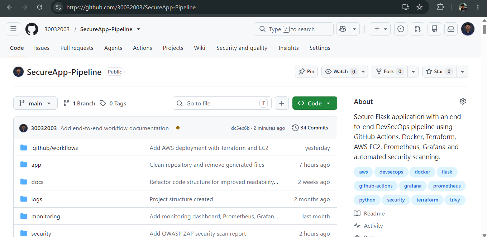
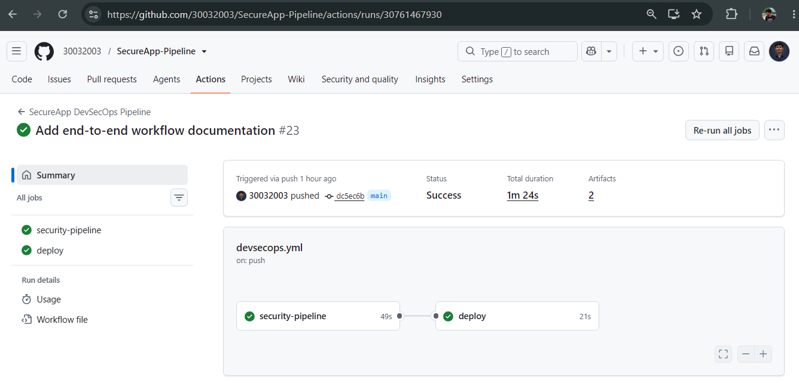
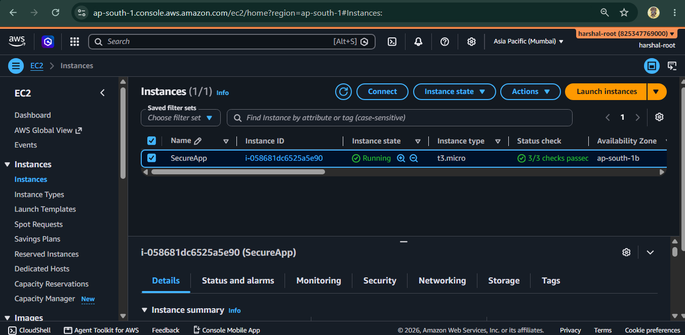
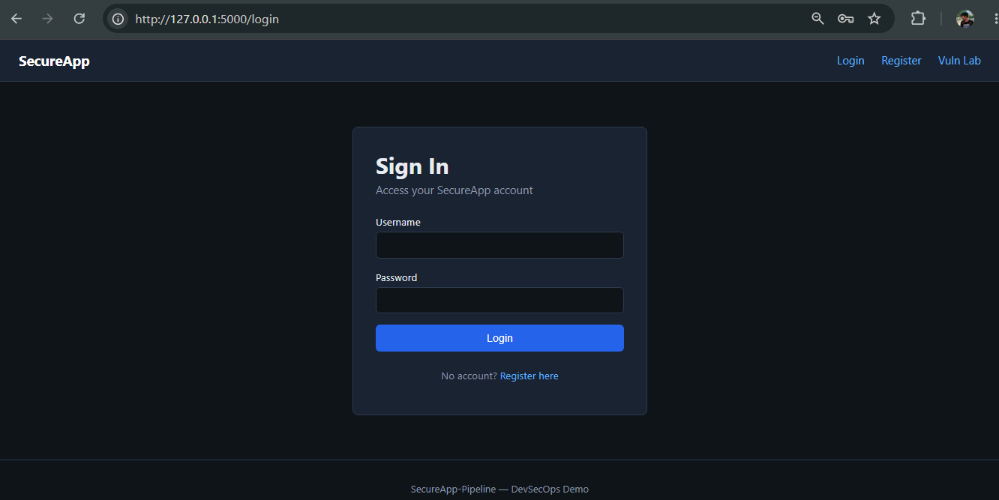
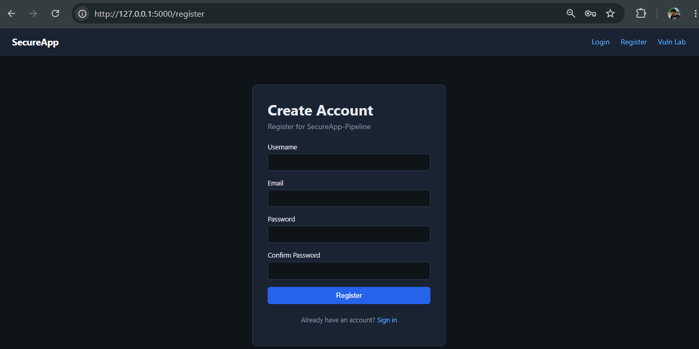
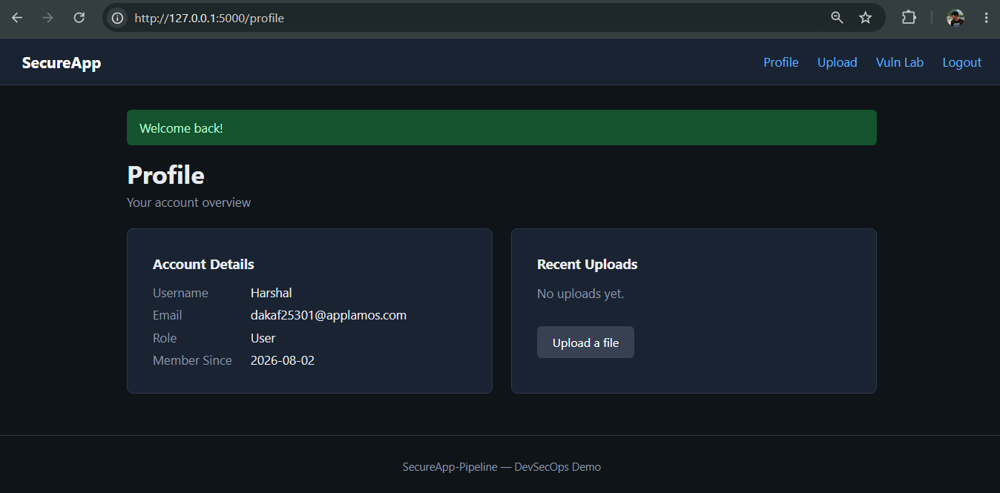
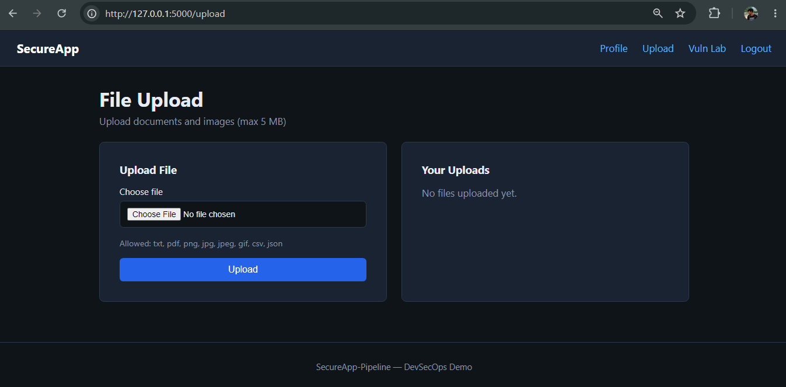
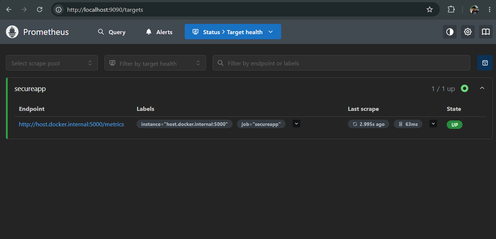
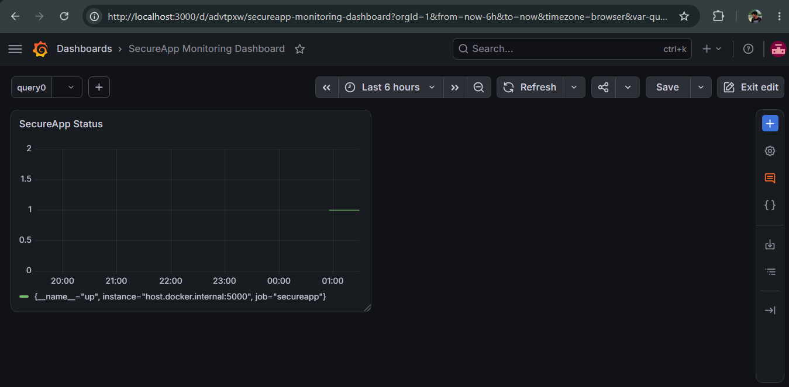

# 🔐 SecureApp Pipeline

> End-to-End DevSecOps Pipeline using Flask, Docker, GitHub Actions, Terraform, AWS EC2, Prometheus, Grafana and Security Scanning Tools.


---

## 📖 Project Overview

SecureApp is a vulnerable Flask-based web application developed to demonstrate the implementation of an end-to-end DevSecOps pipeline. The project integrates secure software development practices by automating security testing, containerization, infrastructure provisioning, continuous deployment, and monitoring.

The pipeline uses GitHub Actions to automate security scans, Docker to package the application, Terraform to provision AWS EC2 infrastructure, and Prometheus with Grafana for monitoring. Multiple security tools including Bandit, Semgrep, Gitleaks, pip-audit, Trivy, and OWASP ZAP are integrated to identify vulnerabilities throughout the Software Development Life Cycle (SDLC).

This project demonstrates how security can be incorporated into every stage of application development, making it suitable for learning modern DevSecOps practices.

## 🚀 Features

- 🔐 User Registration and Login Authentication
- 📤 Secure File Upload Functionality
- 🐳 Dockerized Flask Application
- ⚙️ Automated CI/CD Pipeline using GitHub Actions
- ☁️ Infrastructure Provisioning using Terraform
- 🖥️ Automated Deployment on AWS EC2
- 🔍 Static Application Security Testing (Bandit, Semgrep)
- 🔑 Secret Detection using Gitleaks
- 📦 Dependency Vulnerability Scanning using pip-audit
- 🛡️ Container Image Scanning using Trivy
- 🌐 Dynamic Application Security Testing (OWASP ZAP)
- 📊 Monitoring with Prometheus
- 📈 Visualization using Grafana
- 🚨 Demonstration of OWASP Top 10 Vulnerabilities

## 🛠️ Technology Stack

| Category | Technologies |
|----------|--------------|
| Programming Language | Python 3.12 |
| Framework | Flask |
| Database | SQLite |
| Containerization | Docker, Docker Compose |
| Version Control | Git, GitHub |
| CI/CD | GitHub Actions |
| Infrastructure as Code | Terraform |
| Cloud Platform | AWS EC2 |
| Monitoring | Prometheus, Grafana |
| Static Security Testing (SAST) | Bandit, Semgrep |
| Secret Scanning | Gitleaks |
| Dependency Scanning | pip-audit |
| Container Security | Trivy |
| Dynamic Security Testing (DAST) | OWASP ZAP |


## 📂 Project Structure

```text
SecureApp-Pipeline/
│
├── .github/workflows/        # GitHub Actions CI/CD pipeline
├── app/                      # Flask application source code
├── docs/                     # Documentation
├── monitoring/               # Prometheus & Grafana configuration
├── security/                 # Security scan reports
│   ├── bandit/
│   ├── semgrep/
│   ├── gitleaks/
│   ├── trivy/
│   └── zap/
├── templates/                # HTML templates
├── terraform/                # Infrastructure as Code
├── Dockerfile
├── docker-compose.yml
├── requirements.txt
└── README.md
```

## 🏗️ Architecture Diagram

The following diagram illustrates the complete SecureApp DevSecOps workflow from code commit to automated deployment and security validation.

<p align="center">
  
</p>


### Pipeline Flow

1. Developer pushes source code to GitHub.
2. GitHub Actions automatically starts the CI/CD pipeline.
3. Security scans are executed using:
   - Bandit
   - Semgrep
   - Gitleaks
   - pip-audit
   - Trivy
4. Docker image is built.
5. Terraform provisions AWS EC2 infrastructure.
6. SecureApp is automatically deployed on EC2 using SSH.
7. OWASP ZAP performs Dynamic Application Security Testing (DAST).
8. Prometheus collects application metrics.
9. Grafana visualizes monitoring dashboards.


## 🚀 Installation & Setup

### 1️⃣ Clone the Repository

```bash
git clone https://github.com/30032003/SecureApp-Pipeline.git
cd SecureApp-Pipeline
```

---

### 2️⃣ Create Virtual Environment

#### Windows

```bash
python -m venv .venv
.venv\Scripts\activate
```

#### Linux/macOS

```bash
python3 -m venv .venv
source .venv/bin/activate
```

---

### 3️⃣ Install Dependencies

```bash
pip install -r requirements.txt
```

---

### 4️⃣ Run the Application

```bash
python app.py
```

Application will be available at:

```
http://localhost:5000
```

---

### 5️⃣ Run using Docker

Build Docker Image

```bash
docker build -t secureapp .
```

Run Container

```bash
docker run -d -p 5000:5000 --name secureapp secureapp
```

---

### 6️⃣ Run using Docker Compose

```bash
docker-compose up --build
```

---

### 7️⃣ Access the Application

```
http://localhost:5000
```


## ⚙️ Infrastructure Deployment

Terraform is used to provision AWS EC2 infrastructure.

```bash
cd terraform

terraform init

terraform plan

terraform apply
```

After successful deployment, Terraform outputs the EC2 Public IP and Public DNS.

GitHub Actions automatically connects to the EC2 instance via SSH and deploys the latest application.


## 🔒 DevSecOps Security Pipeline

The SecureApp project follows a DevSecOps approach by integrating multiple security tools into the CI/CD pipeline. Every code change pushed to the GitHub repository automatically triggers static security scans, dependency analysis, secret detection, container image scanning, and deployment. Dynamic Application Security Testing (DAST) is performed using OWASP ZAP against the deployed application.

| Tool | Category | Purpose |
|------|----------|---------|
| Bandit | SAST | Detects Python security vulnerabilities in source code |
| Semgrep | SAST | Performs static code analysis using security rules |
| Gitleaks | Secret Scanning | Detects hardcoded secrets, API keys, and credentials |
| pip-audit | Software Composition Analysis (SCA) | Identifies vulnerable Python dependencies |
| Trivy | Container Security | Scans Docker images for known vulnerabilities |
| OWASP ZAP | DAST | Performs Dynamic Application Security Testing against the deployed application |


### 🔄 CI/CD Security Workflow

```text
Developer
      │
      ▼
Git Push
      │
      ▼
GitHub Actions
      │
      ├── Checkout Repository
      ├── Install Dependencies
      ├── Bandit Scan
      ├── Semgrep Scan
      ├── Gitleaks Scan
      ├── pip-audit Scan
      ├── Docker Build
      ├── Trivy Scan
      └── Upload Security Reports
              │
              ▼
      Deploy to AWS EC2
              │
              ▼
     OWASP ZAP Dynamic Scan
              │
              ▼
      Live SecureApp Application
```

### 📄 Security Reports

The pipeline automatically generates reports for:

- ✅ Bandit Report
- ✅ Semgrep Report
- ✅ Gitleaks Report
- ✅ pip-audit Report
- ✅ Trivy Report
- ✅ OWASP ZAP Report

These reports help identify security issues before and after deployment, enabling continuous security validation throughout the Software Development Life Cycle (SDLC).


## ☁️ Deployment & Monitoring

### AWS Deployment

The application is deployed on an AWS EC2 instance provisioned using Terraform. GitHub Actions automatically deploys the latest version of the application after successful security validation.

Deployment Workflow:

```text
Developer
      │
      ▼
GitHub Repository
      │
      ▼
GitHub Actions
      │
      ▼
Security Scans
      │
      ▼
Docker Build
      │
      ▼
Terraform Provisioned AWS EC2
      │
      ▼
Automatic Deployment via SSH
      │
      ▼
SecureApp Running on Docker
```

---

### Infrastructure

| Component | Technology |
|-----------|------------|
| Cloud Provider | AWS |
| Compute Service | EC2 |
| Infrastructure as Code | Terraform |
| Deployment Method | GitHub Actions + SSH |
| Container Runtime | Docker |

---

### Monitoring Stack

The application exposes Prometheus metrics, which are collected and visualized through Grafana dashboards.

Monitoring Flow:

```text
SecureApp Flask
        │
        ▼
 /metrics Endpoint
        │
        ▼
 Prometheus
        │
        ▼
 Grafana Dashboard
```

---

### Monitoring Components

| Component | Purpose |
|-----------|---------|
| Prometheus | Collects application metrics |
| Grafana | Visualizes metrics using dashboards |
| Flask Metrics | Exposes application metrics for monitoring |


## 🔄 End-to-End Project Workflow

The following workflow demonstrates how SecureApp follows DevSecOps principles from code development to deployment and monitoring.

```text
Developer
      │
      ▼
Develops SecureApp Features
      │
      ▼
Pushes Code to GitHub Repository
      │
      ▼
GitHub Actions CI/CD Pipeline Starts
      │
      ├── Checkout Repository
      ├── Setup Python Environment
      ├── Install Dependencies
      ├── Run Bandit (SAST)
      ├── Run Semgrep (SAST)
      ├── Run Gitleaks (Secret Scanning)
      ├── Run pip-audit (Dependency Scanning)
      ├── Build Docker Image
      ├── Run Trivy (Container Scanning)
      └── Upload Security Reports
              │
              ▼
Terraform Infrastructure
              │
              ▼
AWS EC2 Instance
              │
              ▼
SSH Deployment
              │
              ▼
Docker Container
              │
              ▼
SecureApp Running
              │
              ▼
OWASP ZAP Scan (DAST)
              │
              ▼
Prometheus Monitoring
              │
              ▼
Grafana Dashboard
```

---

### Workflow Explanation

### 1. Source Code Management

The developer implements new features or security improvements and pushes the latest code to the GitHub repository.

---

### 2. Continuous Integration (CI)

GitHub Actions automatically starts the CI pipeline.

During this stage:

- Source code is checked out.
- Python dependencies are installed.
- Security tools are executed.
- Docker image is built.
- Security reports are generated.

---

### 3. Infrastructure Provisioning

Terraform provisions the AWS infrastructure required to host the application.

Resources include:

- AWS EC2 Instance
- Security Group
- User Data Script

---

### 4. Continuous Deployment (CD)

After successful validation, GitHub Actions connects to the EC2 instance through SSH.

Deployment process:

- Pull latest source code
- Build Docker image
- Stop existing container
- Deploy updated container

---

### 5. Dynamic Security Testing

OWASP ZAP performs Dynamic Application Security Testing (DAST) against the deployed application to identify runtime web security vulnerabilities.

---

### 6. Monitoring

Prometheus continuously collects metrics from the application.

Grafana visualizes:

- Application Health
- Metrics
- Monitoring Dashboards

This enables continuous monitoring of the deployed application.


## 📸 Project Screenshots

### GitHub Repository



---

### GitHub Actions CI/CD Pipeline



---

### AWS EC2 Deployment



---

### SecureApp Login Page



---

### User Registration



---

### User Profile



---

### File Upload



---

### Terraform Infrastructure Deployment


---

### Prometheus Monitoring



---

### Grafana Dashboard



---

### Bandit Security Report


---

### Semgrep Security Report


---

### Trivy Container Scan


---

### OWASP ZAP Dynamic Security Scan

